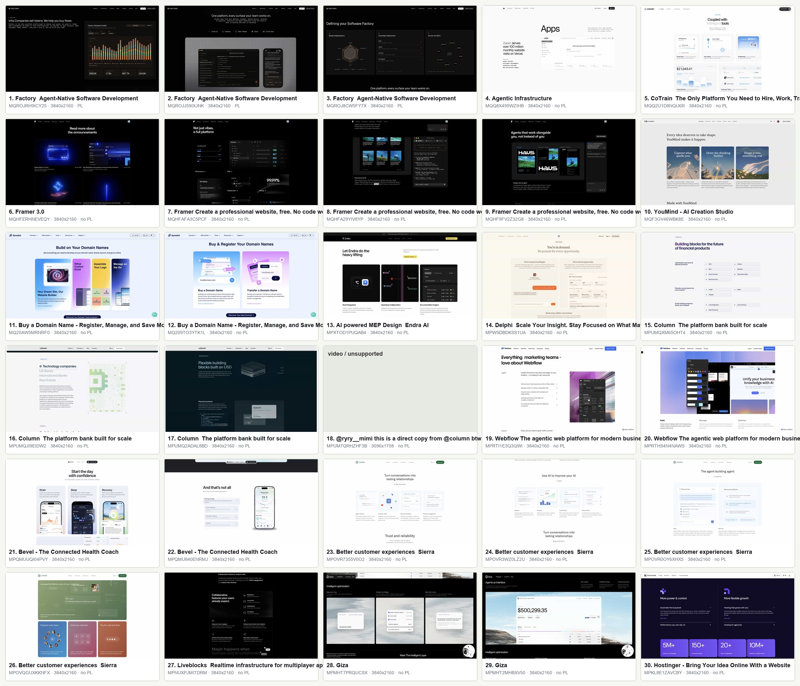

# UIBook Pattern Layer: Section_Featured Research

Date: 2026-06-26  
Source folder: `Section_Featured 产品功能亮点`  
Eagle folder id: `K60RMBANRMW95`

## Why This Pass Exists

The goal is not to invent another flat taxonomy. The valuable part of Pattern Layer is using machine analysis to do the slow design-thinking work: compare many real screenshots, separate surface style from reusable structure, and help designers find similar inspiration by intent and shape.

For this pass, keep the scope narrow:

- Start from one real Eagle folder: `Section_Featured 产品功能亮点`.
- Review the most recent 30 items before changing the framework again.
- Treat `Section_Featured` as a broad container, not a final pattern.
- Promote only recurring `message_intent + structure_pattern` combinations.
- Do not write back to Eagle during discovery; first build a read-only matrix.

## Sample

Current local read-only scan:

- 68 total items matched this Eagle folder.
- Recent 30 items were sampled by newest `btime`.
- 29 are image screenshots; 1 is an mp4 item.
- Most screenshots are `3840x2160` single-screen sections, which are suitable for section-level Pattern Layer analysis.
- Raw item snapshot: [section-featured-recent30.json](assets/section-featured-recent30.json)



## Current Core Signature

Keep the core similarity signature compact:

```text
section_type / message_intent / structure_pattern / layout_skeleton / content_style
```

Concrete screenshot subjects such as dashboard mockups, app screens, avatar grids, workflow diagrams, and logo arrays should stay in `Evidence` or `Visual Memory Cues`, not in the core signature.

## Early Reading From The 30 Samples

`Section_Featured` is not one pattern. It is a section type that contains several design intentions.

The early clusters from this sample look like:

| Candidate intent | What it helps the viewer do | Common structures seen in the sample | Example ranks |
|---|---|---|---|
| `capability-overview` | Quickly understand a set of product capabilities | equal-card-grid, feature-card-row, bento-capability-grid | 10, 11, 12, 15, 16, 19, 20, 23, 26 |
| `single-capability-deep-dive` | Understand one important capability in detail | split-copy-product-panel, centered-product-panel, annotated-mockup-panel | 2, 3, 7, 8, 9, 13, 17, 22, 25, 27, 28, 29 |
| `proof-backed-benefit` | Believe a feature claim through visible data or metrics | dashboard-proof-panel, metric-card-row, chart-led-panel | 1, 14, 24, 30 |
| `workflow-explainer` | Understand how the feature works step by step | horizontal-step-flow, process-panel, node-flow-panel | 3, 13, 23, 25 |
| `ecosystem-capability` | Understand integrations, apps, tools, or connected systems | app-ecosystem-grid, connected-tools-panel, integration-card-matrix | 4, 5 |
| `use-case-gallery` | See the range of scenarios a product supports | use-case-card-gallery, scenario-card-row, visual-example-grid | 6, 10, 26 |
| `comparison-support` | Compare options, states, or before/after differences | side-by-side-comparison, plan-like-feature-matrix | 12, 14, 15 |

These are not final names yet. They are working labels for review.

## Naming Notes

Good pattern names should describe reusable structure, not business claims.

Prefer:

- `dashboard-proof-panel`
- `split-copy-product-panel`
- `annotated-mockup-panel`
- `equal-card-grid`
- `app-ecosystem-grid`
- `use-case-card-gallery`

Avoid names that repeat the intent:

- `conversion-push-cta`
- `comparison-grid`
- `trust-proof-wall`

The intent should live in `message_intent`; the physical shape should live in `structure_pattern`.

## Discovery Matrix To Build Next

For the next pass, fill one row per screenshot:

```text
rank
item_id
visible_summary
message_intent
structure_pattern
layout_skeleton
content_style
evidence
confidence
naming_note
```

Then cluster by:

```text
message_intent + structure_pattern
```

Promotion rule:

- If a combination appears 3 or more times across different brands or products, promote it to a candidate formal UIBook pattern.
- If it appears only once, keep it as an observation, not a taxonomy value.
- If two screenshots look visually similar but solve different intentions, do not cluster them together.
- If two screenshots use different visual styles but share the same intention and structure, cluster them together.

## Product Interpretation

The user-facing value should not be "more filters." The paid-level value is Smart Discovery:

- "Show me sections that explain one complex product capability."
- "Find feature sections that use data or dashboards as proof."
- "Find capability overview sections with multiple equal cards."
- "Find feature sections that show an ecosystem of apps/tools."
- "Find examples where product screenshots carry most of the explanation."

The system can translate those search intents into Pattern Layer signatures without forcing the designer to know every taxonomy term.

## Open Questions

- Should `proof-backed-benefit` be a `message_intent`, or is it closer to `trust-building` with a data-led content style?
- Should `single-capability-deep-dive` and `deep-dive-showcase` be merged?
- Do mobile app feature showcases need their own `structure_pattern`, or are they just `centered-product-panel` plus `screenshot-led`?
- Should `ecosystem-capability` live under Features, Integrations, or both?
- How often should a repeated brand in the sample count toward promotion? Multiple screenshots from Factory or Framer should probably count as one brand-level signal until confirmed across other products.
